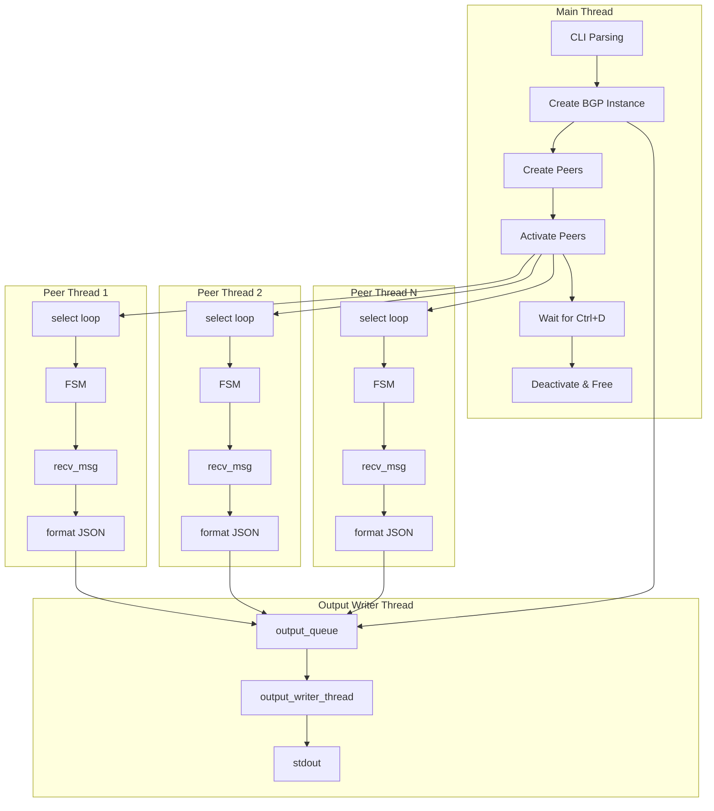

# BGPSee Architecture

This document describes the internal architecture of BGPSee, following the lifecycle of the application from startup through peering, message reception, and shutdown.

## Threading Model

BGPSee uses three types of threads: a main thread that handles startup and lifecycle, one thread per BGP peer that manages the protocol state machine, and a single output writer thread that serialises JSON to stdout.

## Key Data Structures

### `struct bgp_instance` (bgp.c)

The top-level container. Holds the local ASN, router ID, BGP version, an array of up to 256 peer pointers, and a shared `output_queue`. Created once at startup and owned by the main thread.

### `struct bgp_peer` (bgp_peer.h)

Per-peer state. Contains the FSM state (`enum bgp_fsm_states`), the TCP socket, an array of protocol timers (`bgp_local_timer[N_LOCAL_TIMERS]`), the peer's thread handle, and two linked-list message queues: `ingress_q` for messages awaiting FSM processing, and `output_q` for messages awaiting JSON formatting. Each peer holds a pointer back to the shared `output_queue`.

### `struct bgp_msg` (bgp_message.h)

A parsed BGP message. Tagged with a `type` (OPEN, UPDATE, KEEPALIVE, NOTIFICATION) and containing the decoded fields in a union. Messages carry two list nodes (`ingress` and `output`) so they can sit on both the ingress and output queues simultaneously.

### `struct output_queue` (output_queue.h)

A mutex+condvar guarded linked list of formatted JSON strings. Peer threads push; the writer thread pops and writes to stdout. This decouples protocol processing from I/O blocking — if stdout is piped to a slow consumer, only the writer thread stalls, not the peer threads that need to send keepalives.

## Startup

Entry is `main()` in `main.c`. After parsing CLI arguments with `getopt_long`, the main thread:

1. Calls `create_bgp_instance()` — allocates the instance, initialises the `output_queue`, and starts the output writer thread via `output_queue_start()`.
2. Parses each peer argument (`<ip>,<asn>[,<name>]`), calling `create_bgp_peer()` for each. This allocates the peer struct, initialises timers with `initialise_local_timers()`, sets up the mutex, and links the peer into the instance's peer array.
3. Calls `activate_bgp_peer()` for each peer, which spawns the peer's thread with `pthread_create()` targeting `bgp_peer_thread()`.

The main thread then blocks reading stdin, waiting for EOF (Ctrl+D) as the shutdown signal.

## Peer Thread and the FSM

Each peer thread runs `bgp_peer_thread()` in `bgp.c`. This is a `select()` loop with a 1-second timeout. Each iteration:

1. Builds an `fd_set` via `get_read_fd_set()` containing the TCP socket and (on Linux) the timer file descriptors.
2. Calls `select()` to wait for socket data or timer fires.
3. If the socket is readable, calls `recv_msg()` to parse the incoming BGP message and places it on both the `ingress_q` and `output_q`.
4. Dispatches to the appropriate FSM state handler.

The FSM states progress as:

**IDLE** (`fsm_state_idle`) — Starts the ConnectRetryTimer, calls `tcp_connect()` to open a TCP connection to port 179. On success, transitions to CONNECT.

**CONNECT** (`fsm_state_connect`) — Builds BGP capabilities (MP extensions, 4-byte ASN, route refresh), sends an OPEN message via `queue_and_send_open()`, starts the HoldTimer, and transitions to OPENSENT.

**OPENSENT** (`fsm_state_opensent`) — Waits for the peer's OPEN. Validates the peer ASN, BGP version, hold time, and negotiates 4-byte ASN support. On success, sends a KEEPALIVE, starts the recurring KeepaliveTimer, and transitions to OPENCONFIRM.

**OPENCONFIRM** (`fsm_state_openconfirm`) — Sends keepalives on timer fires. Waits for the peer's KEEPALIVE confirming the session. On receipt, transitions to ESTABLISHED.

**ESTABLISHED** (`fsm_state_established`) — The steady state. Sends keepalives on timer fires, resets the HoldTimer on any received message (KEEPALIVE or UPDATE). UPDATE messages are parsed and queued for output. A received NOTIFICATION or hold timer expiry closes the session.

## Message Reception and Output

When `recv_msg()` in `bgp_message.c` reads from the socket, it validates the 16-byte marker and message header, then dispatches to type-specific parsers (`parse_open_body`, `parse_update_body`, etc.) that decode path attributes, NLRI prefixes, and capabilities into the `bgp_msg` structure.

After the FSM processes the message (marking it `actioned`), `print_bgp_msg_and_gc()` iterates the `output_q`, formats each actioned message to a JSON string using jansson (`format_msg_json` or `format_msg_jsonl` in `bgp_print.c`), and pushes the string to the shared `output_queue` via `output_queue_push()`.

The output writer thread (`output_writer_thread` in `output_queue.c`) blocks on `pthread_cond_wait()` until items arrive, then writes each JSON string to stdout with `fflush()`. This architecture means that even if stdout blocks for seconds, peer threads continue processing protocol messages and sending keepalives.

## Timer Management

BGPSee uses RFC 4271 timers: ConnectRetryTimer, HoldTimer, KeepaliveTimer, and IdleHoldTimer (for reconnection backoff). On Linux, these are implemented with `timerfd` file descriptors that integrate naturally with `select()`. On macOS, a polling approach uses `clock_gettime(CLOCK_MONOTONIC)` to check absolute expiry times each loop iteration — acceptable since BGP timers are all second-resolution (15s-120s) and the select loop runs at least once per second.

Key timer functions: `start_timer()`, `start_timer_recurring()`, `disarm_timer()`, `set_timer_value()`, and `timer_has_fired()`.

## Shutdown

When the main thread detects EOF on stdin:

1. Calls `deactivate_all_bgp_peers()`, which sets `peer->active = 0` for each peer and joins the thread.
2. Each peer thread exits its select loop, sends a CEASE NOTIFICATION (`BGP_ERR_CEASE_ADMIN_SHUT`), and closes the socket.
3. The main thread calls `free_all_bgp_peers()` to release per-peer resources.
4. Calls `free_bgp_instance()`, which signals `output_queue_shutdown()`, joins the writer thread, and frees the instance.

If reconnection is enabled (`--reconnect`), a failed session arms the IdleHoldTimer with exponential backoff (5s to 120s) instead of exiting the thread. The peer thread re-enters IDLE when the timer fires.
